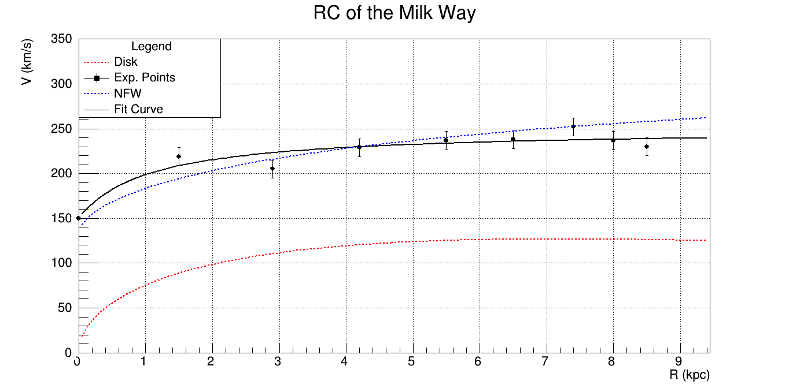

# Astroparticle Physics & Cosmology 🌌

This folder contains computational models developed during my **Undergraduate Research (IC)** supported by **FAPESP** (São Paulo Research Foundation). The projects focus on the intersection of Galactic Dynamics and Dark Matter (WIMP) detection.

## 1. Milky Way Rotation Curve Analysis
**File:** `src/milky_way_nfw_profile.cpp`

This project simulates the rotation velocity of our galaxy to address the "missing mass" problem. It compares observational data with a multi-component mass model.

### 🔬 Physics & Modeling
* **Stellar Disk:** Modeled using an exponential mass distribution.
* **Dark Matter Halo:** Implemented using the **Navarro-Frenk-White (NFW)** profile, the benchmark in modern cosmology.
* **Data Source:** Observational points provided by the **MIT Haystack Observatory** ([Memo SRT 011](https://www.haystack.mit.edu/wp-content/uploads/2020/07/memo_SRT_011.pdf)).

### 📊 Results

*The **Total Fit** (black solid line) successfully matches the experimental data points by incorporating the Dark Matter halo (blue dashed line).*

---

## 2. Solar WIMP Capture Rates
**File:** `src/solar_wimp_capture_rates.cpp`

This simulation calculates the rate at which **Weakly Interacting Massive Particles (WIMPs)**, a leading Dark Matter candidate, are gravitationally captured by the Sun through scattering with various nuclei.

### 🔬 Key Features
* **Multi-Element Modeling:** Individual capture contributions from **Hydrogen (H)** through **Iron (Fe)**.
* **Nuclear Form Factors:** Implementation of $F(x)$ to account for the loss of coherence in high-energy WIMP-nucleus scattering (based on the Jungman et al. model).

---

## 🛠️ Project Structure

* **`src/`**: Contains the C++ source code for the simulations.
    * `milky_way_nfw_profile.cpp`: Galactic mass modeling and rotation curve fitting.
    * `solar_wimp_capture_rates.cpp`: Numerical calculation of WIMP capture by solar nuclei.
* **`results/`**: High-fidelity plots generated using the CERN ROOT framework.

## ⚙️ Technical Framework
* **Language:** C++
* **Analysis Tool:** [CERN ROOT](https://root.cern/) (used for high-precision function fitting and statistical plotting).
* **Research Grant:** FAPESP (São Paulo Research Foundation).
