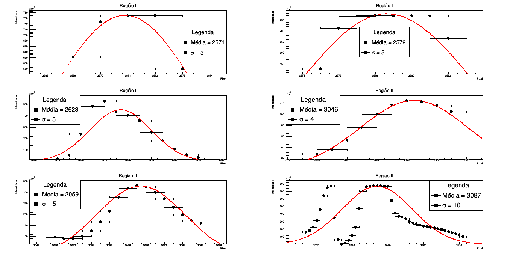
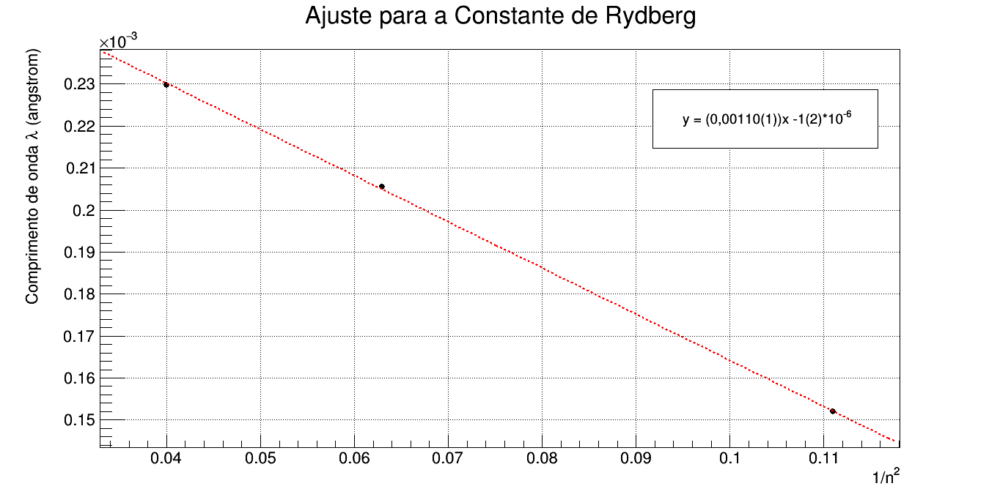

# Experimental Physics: Atomic Spectroscopy & Quantum Phenomena 🧪

This repository documents the computational analysis of experimental data from the **Modern Physics Laboratory** at the **University of São Paulo (USP)**. The focus is on using the **CERN ROOT** framework to process spectral data, perform statistical fitting, and validate fundamental physical constants.

## 🔬 Project Overview

This project is divided into key experimental stages, each focusing on a specific aspect of atomic physics and data modeling.

### 1. Mercury (Hg) Spectral Calibration
The first stage involves spectral calibration using a Mercury lamp. By identifying the exact pixel positions of known emission lines, we establish a precise pixel-to-wavelength mapping.
* **Methodology:** Non-linear Least Squares Fitting using **Gaussian Models**.
* **Key Parameters:** Centroids ($\mu$) for sub-pixel peak location and dispersion ($\sigma$) for line width analysis.

### 2. Rydberg Constant Determination
Analysis of the Hydrogen emission spectrum (Balmer Series) to calculate one of the fundamental constants of atomic physics.
* **Physical Model:** Linearized Rydberg formula.
* **Methodology:** Chi-square minimization to find the slope of wavelength vs $1/n^2$.
* **Goal:** Experimental derivation of the Rydberg Constant ($R_H$).

## 🛠️ Technical Implementation

The scripts are implemented in **C++** leveraging the **CERN ROOT** scientific framework:
* **`TGraphErrors`**: Used to handle raw intensity data while accounting for experimental uncertainties.
* **`TF1` & `Fit`**: Automated fitting using both built-in (`gaus`) and user-defined functions to minimize $\chi^2$.
* **Data Visualization**: Customized legends and multi-panel canvases for publication-quality plots.

## 📊 Results

### Mercury Spectral Analysis

*Figure 1: Gaussian fits for Regions I and II of the Hg spectrum. These results determine the peak means required for calibration.*

### Rydberg Constant Fit (Hydrogen)

*Figure 2: Linear regression applied to the Balmer Series. The mathematical model fits the experimental wavelengths to extract the Rydberg constant.*

---

## 📂 Directory Structure

```text
.
├── README.md
├── results/
│   ├── mercury_spectral_analysis.png
│   └── rydberg_fit_hydrogen.png
└── src/
    ├── mercury_spectral_calibration.cpp
    └── rydberg_constant_fit.cpp
