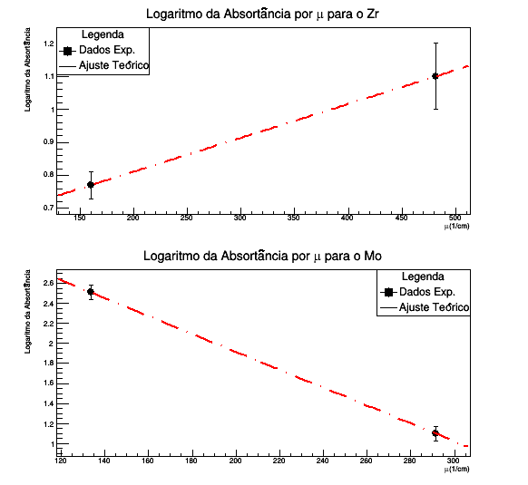

# Experimental Physics: Atomic Spectroscopy & Radiation Interaction 🧪

This repository documents the computational analysis of experimental data from the **Modern Physics Laboratory** at the **University of São Paulo (USP)**. The focus is on using the **CERN ROOT** framework to process spectral data, perform statistical fitting, and validate fundamental physical laws.

## 🔬 Project Overview

This project is divided into three key experimental stages, each demonstrating a different aspect of data modeling in physics.

### 1. Mercury (Hg) Spectral Calibration
Used to establish a precise pixel-to-wavelength mapping for spectrometer calibration.
* **Methodology:** Non-linear Least Squares Fitting using **Gaussian Models**.
* **Goal:** Sub-pixel peak identification for high-precision measurement.

### 2. Rydberg Constant Determination
Analysis of the Hydrogen emission spectrum (Balmer Series) to calculate a fundamental atomic constant.
* **Physical Model:** Linearized Rydberg formula.
* **Methodology:** Chi-square minimization to find the slope of wavelength vs $1/n^2$.
* **Goal:** Experimental derivation of the Rydberg Constant ($R_H$).

### 3. X-Ray Attenuation (Zr & Mo)
Study of how radiation interacts with matter by measuring attenuation in Zirconium and Molybdenum.
* **Physical Model:** **Beer-Lambert Law** ($I = I_0 e^{-\mu x}$).
* **Methodology:** Logarithmic transformation and linear regression of absorbance vs. attenuation coefficients.
* **Goal:** Validation of the exponential decay of radiation through shielding materials.

## 🛠️ Technical Implementation

The scripts are implemented in **C++** leveraging the **CERN ROOT** scientific framework:
* **`TGraphErrors`**: Handles experimental counts while accounting for uncertainties (error bars).
* **`TF1` & `Fit`**: Automated fitting using optimized numerical algorithms.
* **Multi-panel Canvas**: Organized visualization of comparative data sets.

## 📊 Results

### Mercury Spectral Analysis

*Figure 1: Gaussian fits for the Hg spectrum calibration.*

### Rydberg Constant Fit (Hydrogen)

*Figure 2: Linear regression applied to the Hydrogen Balmer Series.*

### X-Ray Attenuation Analysis

*Figure 3: Absorbance analysis for Zr and Mo verifying the Beer-Lambert law.*

---

## 📂 Directory Structure

```text
.
├── README.md
├── results/
│   ├── mercury_spectral_analysis.png
│   ├── rydberg_fit_hydrogen.png
│   └── xray_attenuation_zr_mo.png
└── src/
    ├── mercury_spectral_calibration.cpp
    ├── rydberg_constant_fit.cpp
    └── xray_attenuation_analysis.cpp
