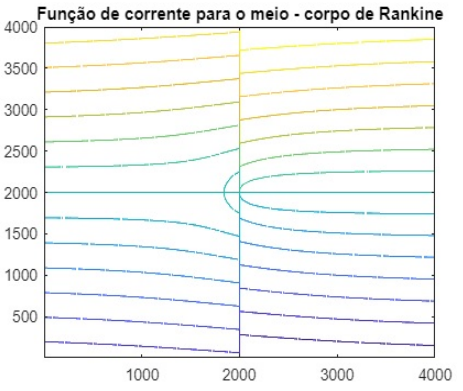
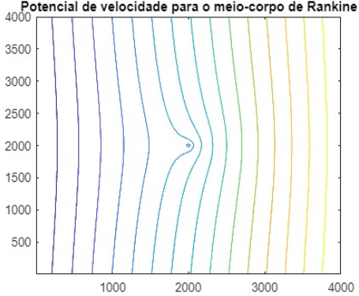

# Fluid Mechanics 🌊

This repository contains numerical solutions and visualizations for potential flow problems, developed as part of the Fluid Mechanics curriculum at the University of São Paulo (USP).

## 🔬 Physics & Modeling
The project focuses on the **Rankine Half-Body**, a classic analytical solution in fluid dynamics representing the superposition of a **Uniform Flow** and a **Point Source**. 

Assuming an incompressible and irrotational flow, we modeled the two fundamental scalar fields:
1. **Stream Function ($\psi$):** Represents the trajectories (lines of flow).
2. **Velocity Potential ($\phi$):** Represents equipotential lines, which are mathematically orthogonal to the streamlines.

---

## 📊 Results and Visualization

The simulations were performed using a high-resolution meshgrid in MATLAB to capture the stagnation point and the flow separation.

### 1. Streamlines ($\psi$)
The plot below shows how the uniform flow (from left to right) interacts with the source at the origin, creating the characteristic "half-body" boundary.

### 2. Velocity Potential ($\phi$)
The following plot shows the equipotential lines. The perpendicularity between these lines and the streamlines confirms the validity of the potential flow model.

---

## 🛠️ Project Structure

* **`src/`**: Contains the source code for the simulations.
    * `stream_function_rankine.m`: MATLAB script for $\psi$ calculation and contour plotting.
    * `velocity_potential_rankine.m`: MATLAB script for $\phi$ calculation and contour plotting.
* **`results/`**: High-resolution plots generated by the scripts.
